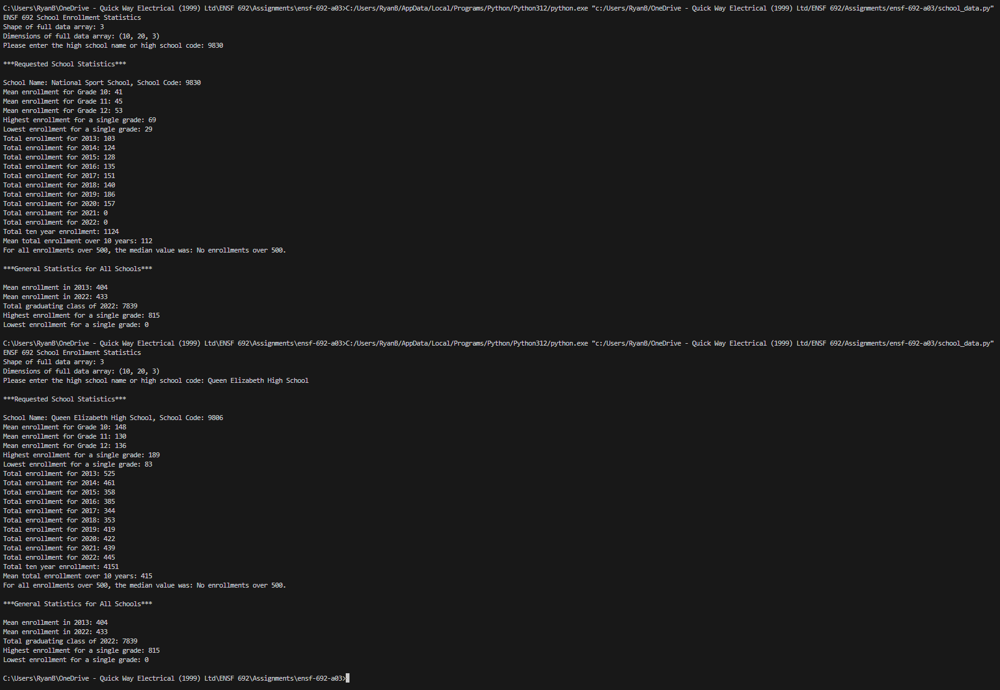

# ENSF 692 Spring 2024 - Assignment 3

**Ryan Baker**

This document serves as a supplement to help ensure that all rubric criteria were met, with explanations and interpretations of the rubric.

## Commenting and Syntax (5 marks)

**(3) Comments must be added throughout the code to explain the functionality**

-  All functions include docstrings and confusing parts of the code include additional comments (e.g line 140 includes `# Some schools have no enrollments over 500.` because it wasn't obvious why an if statement is necessary).

**(2) All classes, methods, and functions are fully documented using docstrings (including summary, parameters, and return values)**

-  No classes or methods were used,

## Code Structure and Sementics (8 marks)

**(3) Solution contains at least one 3-dimensional array**

-  See variable `grades`

**(1) Solution Contains at least one subarray view**

-  `get_school_data()` returns a subarray view.

**(2) Solution contains at least four different NumPy computational functions**

-  NumPy computational functions include `numpy.nanmax()`, `numpy.nanmin()`, `numpy.nanmean()`, `numpy.nanmedian()`.

**(1) Solution contains at least one dictionary**

-  See variable `schools`. It is a List of dictionaries, so technically the solution contains 20 dictionaries (one for each school).

## User Interface and Functionality (6 marks)

**(1) User is given clear guidance on how to enter input values**

-  User is prompted "Please enter high school name or high school code", exactly as per the example.
-  If invalid input is entered, a message "Invalid input" is displayed, followed by another prompt "Please enter high school name or high school code".

**(1) Program accepts either the school name or school code**

-  Accepts both codes and school names. _NOTE: school name is case and punctuation sensitive_

**(1) If an invalid name or code is provided, a ValueError exception is used to prompt for re-rentry without terminating the program**

-  See `validate_input()`.

**(1) The program prints the shape and dimension of the 3-dimensional array**

-  Yes. See screenshot below.

**(1) All values are displayed as floored integers (e.g. 5/2 = 2, not 2.0 or 2.5)**

-  Yes. See screenshot below.

**(1) NaN values are handles using built-in NumPy functionality**

-  There were a number of ways this could have been done (masking or using NumPy built-in functions for handling NaN values). The built-in NumPy NaN functions were chosen out of convenience (e.g. `numpy.nanmean()` was used instead of `sample_array[~numpy.isnan(sample_array)]`)

## Execution (6 marks)

**(3) Provide a screenshot of successful execution. Your screenshot should include all specified functionality**

**(3) Your program will be executed to test the following cases:**

-  Entering a school name that is included in the provided dataset
   -  Tested.
-  Entering a school code that is included in the provided dataset
   -  Tested.
-  Entering an invalid input that is not included in the provided dataset
   -  Tested.

## Calculations (8 marks)

-  **The following school-specific calculations will be checked for accuracy (will vary depending on the user input):**

   -  **The school name and school code**
      -  Taken directly from `given_data.csv` with the help of Excel formulas.
   -  **Mean enrollment for Grade 10 across all years**
      -
   -  **Mean enrollment for Grade 11 across all years**
      -
   -  **Mean enrollment for Grade 12 across all years**
      -
   -  **Highest enrollment for a single grade within the entire time period**
      -
   -  **Total enrollment for each year from 2013 to 2022**
      -
   -  **The total enrollment across ten years**
      -
   -  **The mean total yearly enrollment across ten years**
      -
   -  **If no enrollment numbers over 500, print "No enrollments over 500"**
      -
   -  **If any enrollment numbers of 500, print the median value of the >500 enrollments**
      -

-  **The following general calculations will be checked for accuracy (will be the same for every run)**
   -  **The mean enrollment for 2013**
      -
   -  **The mean enrollment for 2022**
      -
   -  **Highest enrollment for a single grade within the entire time period (across all schools)**
      -
   -  **Lowest enrollment for a single grade within the entire time period (across all schools)**
   -
